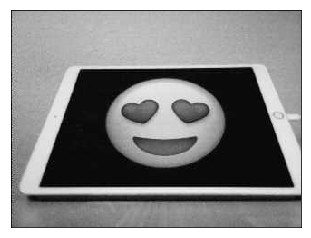

# cozmo-emoji-bingo 

The main idea of this project is to implement the concepts of deep learning on a physical model in interactive environment.

<!-- ## Table of Contents
1. [About Cozmo](#about-cozmo)
2. [Playng Bingo with Robot](#playing-bingo-with-robot)
3. [Generating Data for Emoji Classification](#generating-data-for-emoji-classification)
    * [Image Data Recording](#image-data-recording)
    * [Image Data Preprocessing and Augmentation](#image-data-preprocessing-and-augmenation)
4. [Deep Learning for Computer Vision](#deep-learning-for-computer-vision)
    * [Model Architecture](#model-architecture)
    * [Training the Model](#training-the-model)  
    * [Patch Selection](#patch-selection)
    * [Results](#results)
5. [Future Directions](#future-directions) -->

## About Cozmo
Cozmo is super awesome.
And he is cute.
Lorem Ipsum


Cozmo has some superpowers that make him stand out:
 * on-board VGA camera,
 * actuator (lift),
 * inertial navigation sensors,
 * SDK with rich python libraries,
 * solid support community.

## Playng Bingo with Robot
Bingo is such fun. More detail will follow soon
## 🤖 vs 🧔 

## Generating Data for Emoji Classification

Getting enough training data is very important for a good deep learning project. Instead of using generic image datasets, I decided to generate image data as Cozmo would see it. 

With a very simple setup, I displayed imogee on iPad, while cozmo was runnin around it and making pictures of the screen. This helped to get shots from different angles as it is expected that Cozmo can have multiple positions during the game.


After collecting images of from Cozmo's camera, I got around 5000 images for all ten classes. Every emogi was displayed on two different backgrounds (black and white).


### Image Data Preprocessing and Augmentation

All images then split into three sets of training, validation and test in **60:20:20** ratio. 
Each set further split into ten subsets of all emojee names correspond to ten classes:

👽 😈 👻 😍 🧔 💄 🐙 💩 🚀 🤖 🦄

```python
targets = ['alien', 
            'devil',
            'ghost',
            'hearteyes',
            'lipstick',
            'octopus',
            'poop',
            'robot',
            'rocket',
            'unicorn']
```

With Cozmo's on-board camera each image has a shape of 320 by 240 pixels.
I chose to use black and white images to make model less computational intensive and training easier.

To mitigate potential overfit problems, I used Keras to augment training images. 
Thhis will help to improve the results although, augmentated images can still be highly correlated. Below are some augmented images.

**Image recorded by Cozmo**:



**Images generated by Keras:**


Augmentation settings:

```python
train_datagen = ImageDataGenerator(
        rescale=1. / 255, #: some notes?
        rotation_range=40, #: some notes?
        width_shift_range=0.2, #: some notes?
        height_shift_range=0.2, #: some notes?
        shear_range=0.2, #: some notes?
        zoom_range=0.2, #: some notes?
        horizontal_flip=True, #: some notes?
        fill_mode='nearest')
```

## Deep Learning for Computer Vision

Convolutional Neural Networks (Convnets) is the type of deep learning model that today almost universally used in computer vision applications.

With the task of image classification network will have two parts:
 * start with a series of pooling and convolution layers, 
 * end with a densely connected classifier.   


### Convnet Architecture

Describe possible architectures for small datasets:

  1. CNN from scratch
        * binary
        * multiclass: 5 classes
        * 
        * 
        * multi classes: 10
        

--> SOME FANCY CHART


  * Transfer Learning - Feature extraction
  * Transfer 


### Model Training and Evaluation

Some Accuracy plots:


Data Augmentation: YesNo
Train-Validation-Test split: 30:10:10
Number of classes: 5


Data Augmentation: Yes
Train-Validation-Test split: 30:10:10
Number of classes: 5
val Accuracy: 

## Model Deployment to Robot 
## Demo

--> link to video
##Conclusion and Future Work


